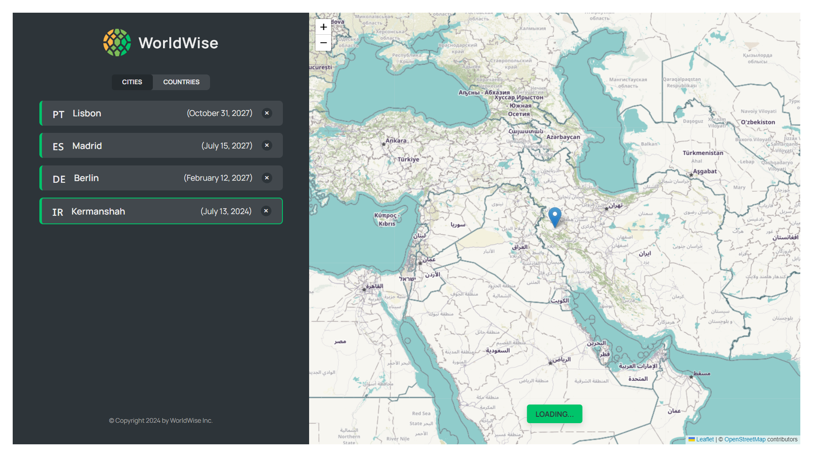

# Travel Journal - Place Collector App

## Description

The **Travel Journal - Place Collector App** is an innovative web-based application designed for individuals who are passionate about travel and exploration. This app serves as a digital diary where users can effortlessly document, organize, and reflect on their travel experiences, all while enabling easy access to their cherished memories.

### Purpose

Traveling can be one of life's most enriching experiences, offering opportunities to explore new cultures, cuisines, and landscapes. However, capturing those moments and remembering the places visited can prove challenging, especially over time. This application aims to bridge that gap by providing a dedicated space for users to store and manage information about places they've visited, effectively preserving memories for years to come.

### Target Audience

The Travel Journal app is designed for:

- **Frequent Travelers**: Those who frequently embark on journeys, whether for leisure, work, or adventure. Users can maintain a comprehensive record of their travels.
- **Travel Enthusiasts**: Individuals who enjoy planning trips and discovering new destinations but may need help in organizing their travel information.
- **Friends and Family**: People who wish to share their travel experiences with loved ones, allowing them to reminisce together.
- **New Travelers**: Those new to travel who want to keep track of their adventures as they explore the world for the first time.

### Benefits

1. **Organization**: The app allows users to categorize places by various criteria, such as regions or types of experiences (cultural, historic, outdoor, etc.). This structure enhances retrievability, making it easier to reflect on past travels.

2. **Memory Preservation**: Users can store detailed information (place name, city, country) alongside personal thoughts or memories tied to each location. This feature ensures that memories remain vivid and accessible.

3. **Ease of Use**: The intuitive interface makes the application user-friendly, allowing users of all tech skill levels to easily navigate and input information.

4. **Visual Appeal**: An aesthetically pleasing design ensures that users enjoy interacting with the app, making the experience of documenting travels engaging and fulfilling.

5. **Accessibility**: As a web application, users can access their travel journal from any device with an internet connection—be it a smartphone, tablet, or computer.

### Potential Use Cases

- **Pre-Trip Planning**: Before setting out on a new adventure, users can create a list of must-visit places, allowing for better-prepared trips.
- **Post-Trip Reflection**: After completing a journey, users can document their experiences in detail, preventing memories from fading into the background.
- **Social Sharing**: Users may choose to share their travel entries on social media or with friends, inspiring others to explore and travel.
- **Travel Blogging**: The app can serve as a foundational tool for aspiring travel bloggers, helping them keep track of their journeys and the stories they wish to share.

Overall, the Travel Journal - Place Collector App is not just a tool but a companion for travelers, allowing them to cherish their adventures and keep their travel dreams alive.

## Installation

1. Clone the repository:

   ```bash
   git clone https://github.com/yourusername/travel-journal.git

   ```

2.Navigate to the project directory:

```bash
  cd travel-journal

```

3.Install the required dependencies:

```bash
  npm install

```

4.Start the application:

```bash
  npm install

```

Once the application is running, it will open in your default web browser at http://localhost:3000.

## Usage

### Adding a Place

1. Enter the name of the place, city, and country in the respective input fields.
2. Click the "Add Place" button to save the entry.

### Viewing Saved Places

- Look at the list displayed on the main page to see all the places you have added.

### Deleting a Place

- Click on the delete icon (🗑️) next to the place to remove it from your collection.

## Screenshots




## Contributing

Contributions are welcome! If you'd like to help improve the Travel Journal project, please follow these steps:

1. **Fork the Repository**: Click on the fork button at the top right of the repository page.
2. **Clone Your Fork**:

   ```bash
   git clone https://github.com/yourusername/travel-journal.git

   ```

3.**Create a Feature Branch**:

```bash
git checkout -b feature/your-feature-name
```

4.**Make Your Changes**: Implement the desired features or fixes.

5.**Commit Your Changes**:

```bash
git commit -m "Add your message here"
```

6.**Push to the Branch**:

```bash
git push origin feature/your-feature-name
```

7.**Open a Pull Request**:Navigate to the original repository and submit your contributions.

```markdown
## License

This project is licensed under the MIT License.

```

## Author

- [AmirMahdi Soleimani](https://github.com/theAmirMahdi)
- Feel free to reach out to me on [LinkedIn](https://www.linkedin.com/in/amirmahdi-soleimani-b65887303/?utm_source=share&utm_campaign=share_via&utm_content=profile&utm_medium=ios_app) for any inquiries.
